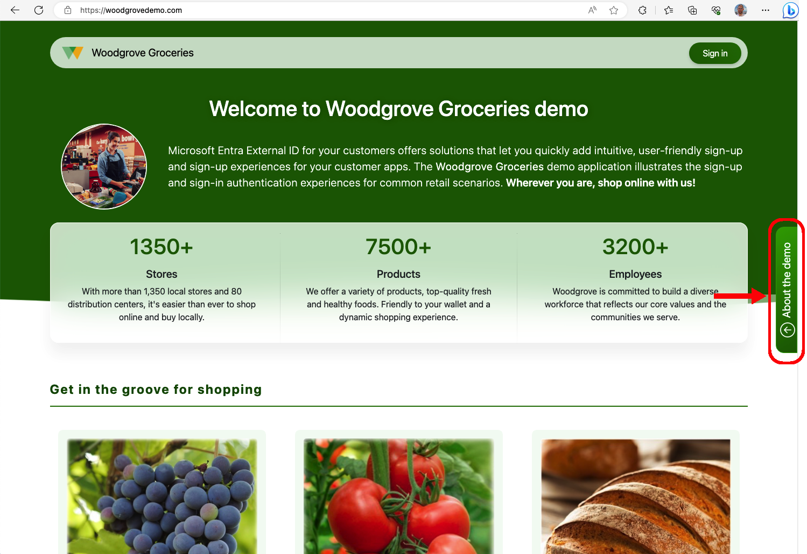

# Woodgrove Groceries demo 

Microsoft Entra External ID offers solutions that let you quickly add intuitive, user-friendly sign-up and sign-up experiences for your customer apps. The Woodgrove Groceries demo environment illustrates several of the most common authentication experiences that can be configured for your customer-facing apps.

To try out the demo environment, go to [Woodgrove Groceries](https://woodgrovedemo.com/) and select from a list of use cases that illustrate different sign-in options and business cases. 

For more information about this demo application, read the [overview of the Woodgrove Groceries demo](https://learn.microsoft.com/entra/external-id/customers/overview-solutions-customers) article.

## Support

This sample application and its source code created by Microsoft to demonstrate some of the Microsoft Entra Extrnal ID user flows. The application and its source code is not supported under any Microsoft standard support program or service. If you find a bug, notice something but are not sure how to solve it, or want to provide product feedback, use the [Issues](https://github.com/microsoft/woodgrove-groceries/issues) tab at the top of the page. You can also @mention collaborators who have access to this repository in an issue to draw their attention to a comment. 

## Contributing

This project welcomes contributions and suggestions. [Learn how to contribue to the Woodgrove live demo](./CONTRIBUTING.md).

## Privacy policy and terms of service

Your privacy is important to us. Our [privacy statement](https://woodgrovedemo.com/Privacy) explains the personal data Woodgrove groceries demo application processes, how we processes it, and for what purposes. We aslo recommand you to check out our [terms of service](https://woodgrovedemo.com/TOS).

